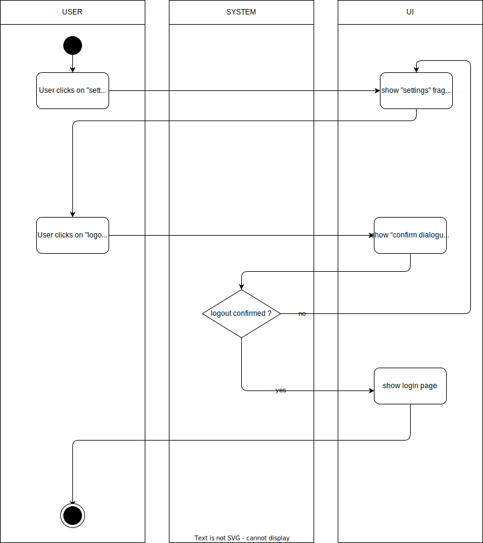
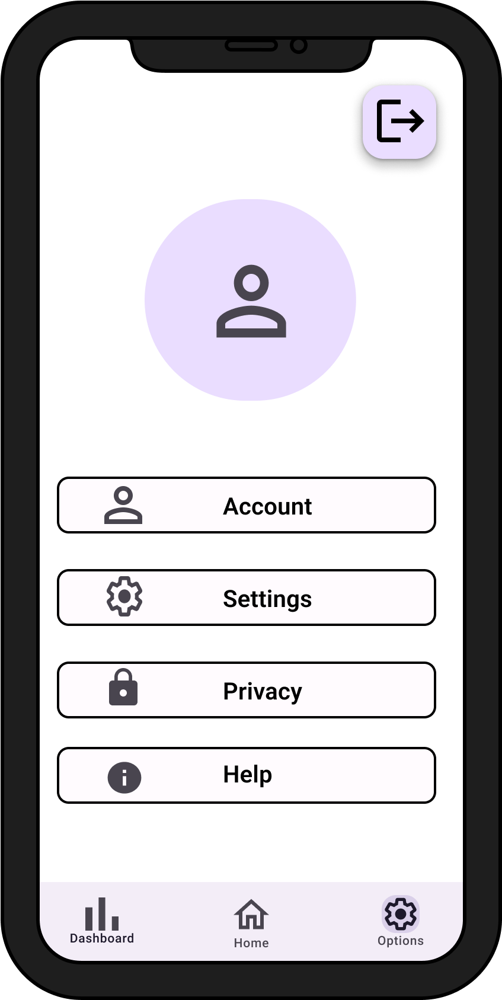

# 1. Use Case description

## Name of use case

Logging out

## 1.1 Brief Description

Every user should have the possibility to log out from their account

# 2 Flow of Events

## 2.1 Basic Flow

- The user clicks on the settings page
- The user can click on the logout button
- The user receives a confirmation dialog for logout
- If the user confirms the dialog, he will be logged out
- Finally, the user is shown the login page

### 2.1.1 Activity Diagram



### 2.1.2 Mock-up



### 2.1.3 Narrative

```gherkin
Feature: logging out

  As a logged-in user
  I want to logout my account
  
  Background: 
    And I am on the settings page
    
    Scenario: successfully logout 
      Given I am signed in with username "USER" and password "PASSWORD"
      And I am on the "settings" page
      When I press on the logout button
      Then I receive a confirm dialog
      When I confirm the logout
      Then I am on the "login" page
      
    Scenario: unsuccessfully logout
      Given I am signed in with username "USER" and password "PASSWORD"
      And I am on the "settings" page
      When I press on the logout button
      Then I receive a confirm dialog
      When I cancel the logout
      Then I am on the "settings" page
      
    Scenario: enter invalid data and save
      Given I am signed in with username "USER" and password "PASSWORD"
      And I am at the "manual adding of data" form
      When I adjust "x€" in the "Store" field
      And I adjust "store xy" in the field "Price"
      And I press the "save" button
      Then I am at the "manual adding of data" form
      And I receive a "error" message
      
      

```


## 2.2 Alternative Flows

(n/a)

# 3 Special Requirements

(n/a)

# 4 Preconditions

## 4.1 Login

The user has to be logged into the system.

# 5 Postconditions

(n/a)

# 6 Extension Points

(n/a)


